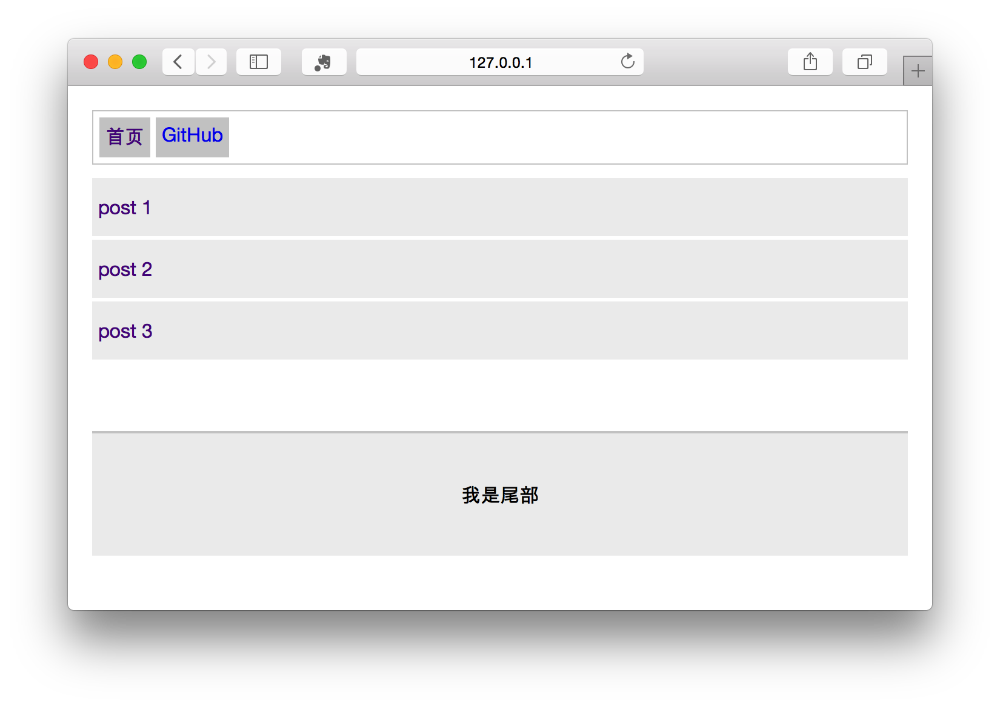

## 起步

### 开始前的说明

- js 模块化使用 **commonJS** 规范，模块框架 `mod.js`

### 安装使用

通过 [README.md](../README.md) 可得知其使用方法

### 一个简单的例子

```
/demo/common
/demo/subsiteA
/demo/subsiteB
```

构造一个例子，其中包含三个模块，每一个模块对应是一个 FIS3 的项目。每一个模块对应一个 SVN 仓库。

> 业务小时，可以只包含一个模块；这三个模块也可以放到一个 SVN 仓库中。
>> 假设版本管理工具选择的是 SVN，当然也可以是 GIT 或其他，下同。


- common 模块包含公用的一些 widget 或 layout 以及可能的一些测试数据
- subsite* 子站模块
    
    > 当站点包含的代码量很大时，就需要考虑拆成子站来单独维护，这样互相上线不会受到干扰，而且也减轻了 SVN merge 的出错几率。

    举个例子，假设 [知道](https://zhidao.baidu.com) 站点，首页为一个模块、分类页作为一个模块、问题页作为一个模块等。


#### 目录结构

每一个模块的目录结构如下；

```
├── fis-conf.js
├── page
├── plugin
├── static
├── server.conf
├── smarty.conf
├── test
└── widget
```

|目录文件|解释|作用范围|
|:------|:---------|:-----------------|
|widget| 放一些 widget，里面代码最终会被组件化封装，需要 require 才能执行|逻辑代码，最终上线|
|page|   放一些页面，子站可能有多个页面|逻辑代码，最终上线|
|plugin| 有一些 Smarty 的插件放入这个目录，当然一般只需要一个模块拥有即可，比如 common|逻辑代码，最终上线|
|static|非组件静态资源|逻辑代码，最终上线|
|test|   测试数据，放一些模拟数据|本地模拟测试使用|
|server.conf  |本地测试的 URL 转发规则配置文件| 本地模拟测试使用|
|smarty.conf     |本地测试的 Smarty 引擎的配置文件，common 模块包含即可|本地模拟测试使用|
|fis-conf.js     |fis3 的配置文件| fis3 构建工具使用 |

*以上目录文件不是都必须需要，一般都会包含page、widget俩目录*

可能从目录结构文件中有一半是提供给本地模拟环境的，所以请不要跟上线文件**搞混**

说完了构造的目录结构，我们开始构造一个应用。

*common*
```
/fis-conf.js
/page/layout.tpl
/plugin
/server.conf
/smarty.conf
/static/layout.less
/static/mod.js
/static/reset.css
/widget/footer
/widget/header
```
- `common/plugin` 一些 FIS 提供的 Smarty 插件或者你自定义的一些 Smarty 插件，可以在[此处下载](https://github.com/fex-team/fis-plus-smarty-plugin)
- `mod.js` FIS 提供的轻量级 JS 模块化框架，简单易用，后续会有章节介绍，你可以在 [/fex-team/mod](https://github.com/fex-team/mod) 找到它

*subsiteA*
```
/fis-conf.js
/page/index.tpl
/server.conf
/test/page/index.php
/widget/post-list
/widget/post-list-item
```

*subsiteB*
```
/fis-conf.js
/page/index.tpl
/server.conf
/test/page/index.php
/widget/post
```

**例子下载** [site.zip](https://github.com/fex-team/fis3-smarty/blob/master/doc/demo/size.zip?raw=true)

### 构建

假定你已经看过 FIS3 的相关文档（http://fis.baidu.com)。

首先下载 demo，然后解压，进入这个目录，执行以下命令对所有模块进行构建发布。

```
fis3 release -r common
fis3 release -r subsiteA
fis3 release -r subsiteB
```

可能有人会问，能否一条命令就构建三个模块，在此处明确说明这是不能的，至少暂时不支持。

### 预览

首先保证你安装了本地**测试模拟环境**套件，如果你忘了安装，按照一下命令安装。

```
fis3 server install server-env
```

启动本地测试服务进行预览，本地测试服务依赖

- java >= 1.6.0
- php-cgi >= 5.2.17

> 这块注意，很多 Mac 使用 Homebrew 安装的都不带 php-cgi，需要在安装时指定编译选项
>> `brew install php55 --with-cgi --with-curl`

> Java 安装完以后需要设置环境变量，切记。


执行以下命令启动服务

```
fis3 server start --type php --rewrite
```

执行成功的话，会打开你的默认浏览器并得出 Demo 的运行结果。

